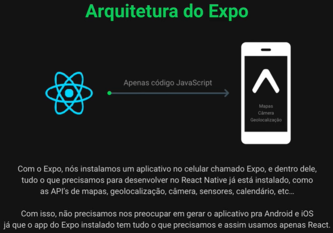

# CODENAME: Ominous

Project developed during Omnistack 11.0 event. We are building an application to connect assistant organizations with people who are willing to help.

## The Stack Technologies
* Node
* React
* React Native

## Programming Languages
* JavaScript [back, front]

## BONUS
* Certificate of Conclusion

## THE BACK-END

## THE WEB APP

## THE MOBILE APP

## THE EXPO ARCHITECTURE

